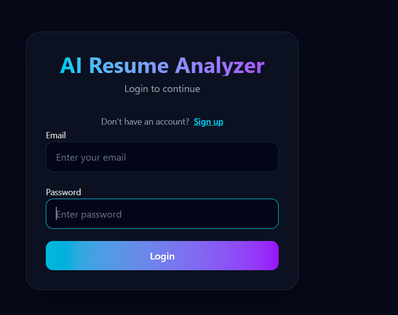
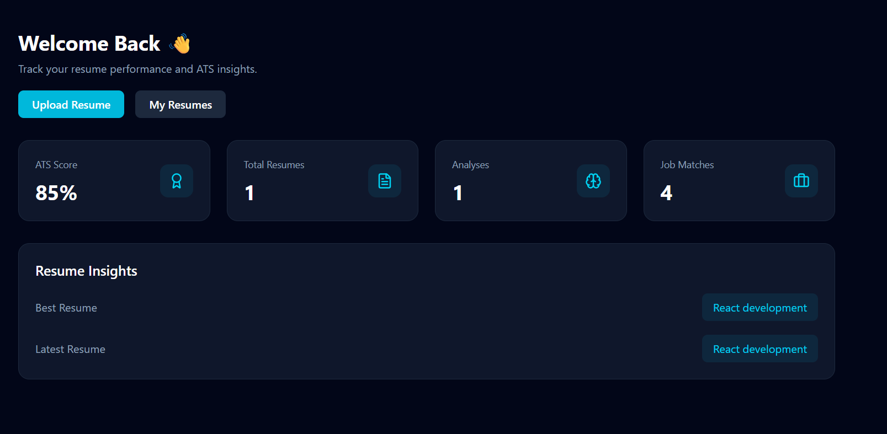
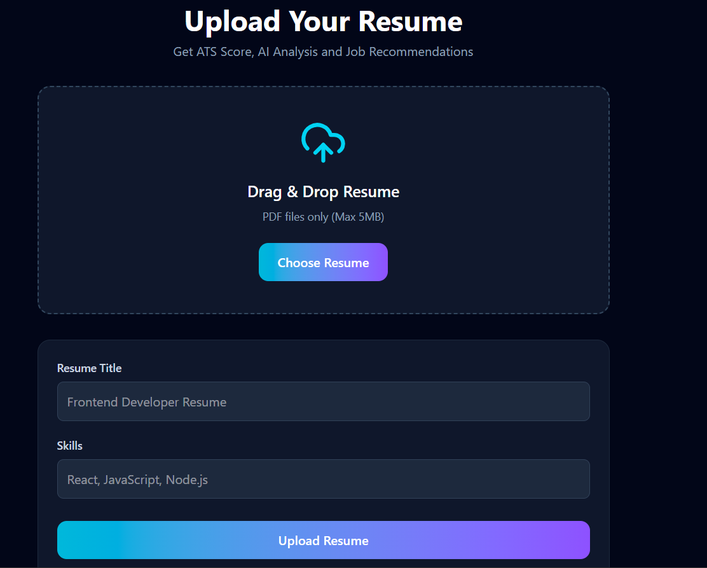
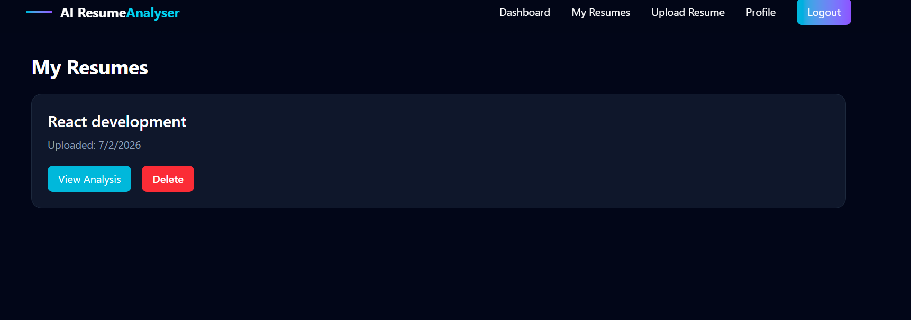
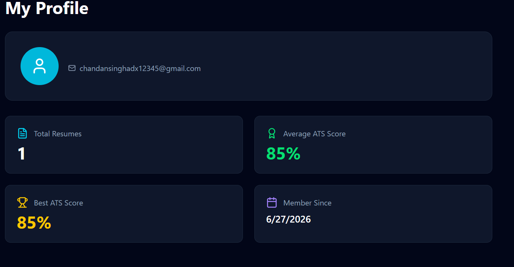
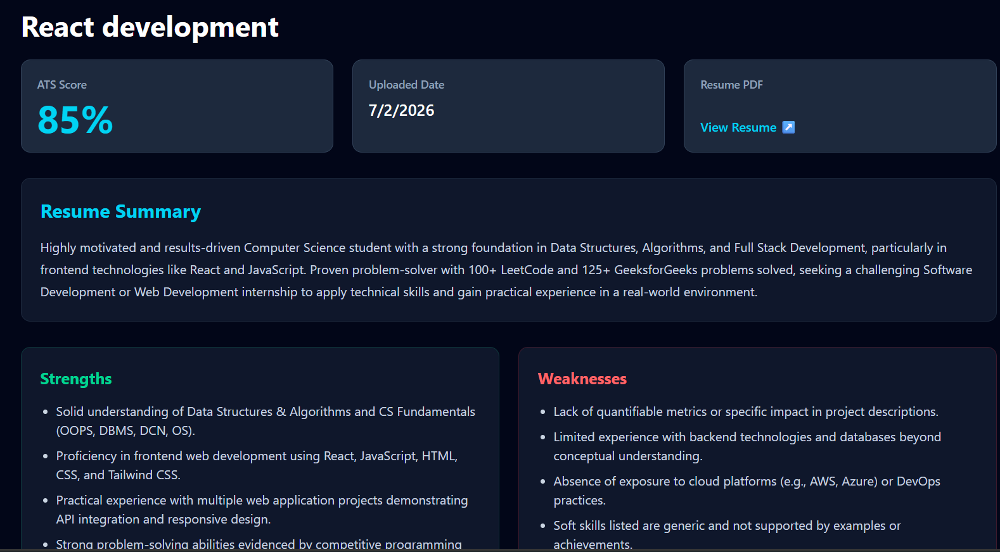
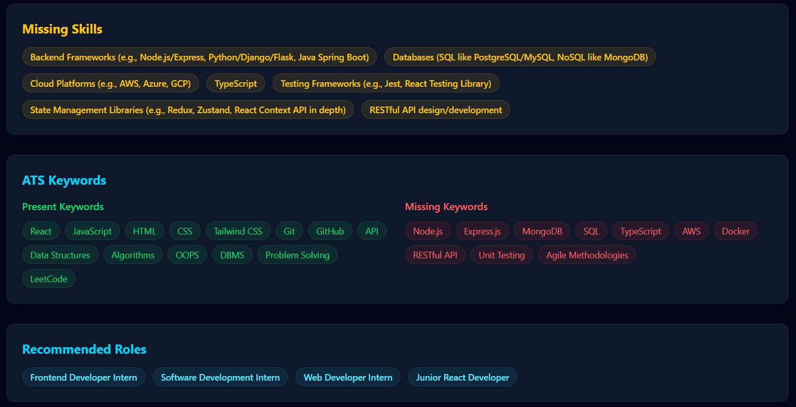
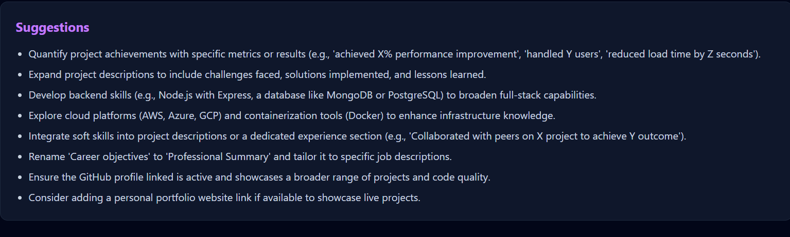

# AI Resume Analyzer

AI Resume Analyzer is a full-stack web application that helps users analyze their resumes using Google Gemini AI. The application generates an ATS score, identifies missing skills, highlights strengths and weaknesses, and recommends suitable job roles.

I built this project to learn how AI can be integrated into a real-world web application while improving my full-stack development skills.

---

## Live Demo

Frontend:
https://ai-resume-analyzer-theta-pink.vercel.app

Backend:
https://ai-resume-analyzer-fi7f.onrender.com

---

## Features

### User Authentication

- Register account
- Login securely
- JWT Authentication
- Protected routes

### Resume Upload

- Upload PDF resumes
- Store resumes securely using Cloudinary
- View uploaded resumes
- Delete resumes

### AI Resume Analysis

After uploading a resume, the application generates:

- ATS Score
- Resume Summary
- Strengths
- Weaknesses
- Missing Skills
- Keyword Analysis
- Job Recommendations
- Resume Improvement Suggestions

### Dashboard

- Total uploaded resumes
- Average ATS Score
- Total analyses
- Job matches
- Latest resume
- Best performing resume

### Profile

- User details
- Total resumes uploaded
- Average ATS score
- Best ATS score
- Account creation date

---

## Tech Stack

### Frontend

- React
- React Router
- Tailwind CSS
- Axios
- React Hot Toast
- Lucide React

### Backend

- Node.js
- Express.js
- MongoDB
- Mongoose
- JWT
- Multer
- Cloudinary
- PDF Parse
- Google Gemini API

---

## Project Structure

```
AI-Resume-Analyzer
│
├── frontend
├── backend
├── screenshots
└── README.md
```

---

## Installation

Clone the repository

```bash
git clone https://github.com/yourusername/AI-Resume-Analyzer.git
```

### Frontend

```bash
cd frontend
npm install
npm run dev
```

### Backend

```bash
cd backend
npm install
npm start
```

---

## Environment Variables

### Backend (.env)

```
PORT=

MONGODB_URI=

JWT_SECRET=

GEMINI_API_KEY=

CLOUDINARY_CLOUD_NAME=

CLOUDINARY_API_KEY=

CLOUDINARY_API_SECRET=
```

### Frontend (.env)

```
VITE_API_URL=
```

---

## API Endpoints

### Authentication

```
POST /auth/register

POST /auth/login
```

### Resume

```
POST /resume

GET /resume

GET /resume/:id

DELETE /resume/:id
```

### Analysis

```
GET /analysis/:id
```

### Dashboard

```
GET /dashboard
```

### Profile

```
GET /profile
```

---

## Screenshots

### Login



### Dashboard



### Upload Resume



### My Resume



### Profile



### Resume Analysis







---

## What I Learned

While building this project, I learned:

- Building REST APIs using Express.js
- JWT Authentication
- MongoDB with Mongoose
- Uploading files using Multer
- Storing PDFs in Cloudinary
- Integrating Google Gemini API
- Parsing PDF resumes
- Deploying frontend and backend separately
- Managing API communication between React and Express

---

## Challenges

Some challenges I faced while building this project:

- Extracting text correctly from PDF resumes
- Integrating Gemini API responses into the application
- Handling authentication securely
- Deploying frontend and backend on different platforms
- Reducing unnecessary AI API calls by saving analysis results in MongoDB

---

## Future Improvements

Some features I plan to add in the future:

- Resume Comparison
- Resume Builder
- ATS Match with Job Description
- Resume Version History
- Download Analysis Report as PDF
- Real Job Recommendations
- Cover Letter Generator

---

## Known Issue

Currently, resume upload works properly on desktop browsers.

Some mobile devices may fail to upload PDF files. I am working on fixing this issue.

---

## Author

Chandan Singh

GitHub:
https://github.com/chandansingh2005

---

If you found this project helpful, feel free to star the repository.